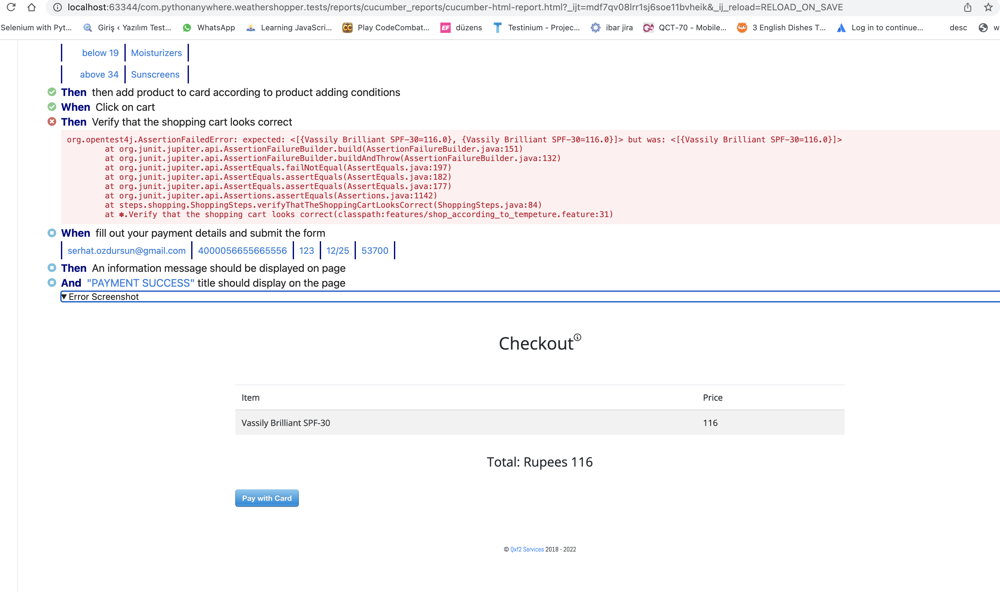

# Test Automation Framework for Beyonnex

- Example Test Automation Framework
    * [Overview](#overview)
        + [Requirements](#requirements)
        + [Project architecture](#architecture)
        + [Report](#report)
        + [Selenium Grid](#grid)
        + [How to run](#run)
        + [Dockerizing](#docker)
<a name="overview"></a>
## Overview
The project has been developed with java. It is a BDD project written by using Cucumber

<a name="requirements"></a>
###Requirements
- Java JDK 18 or higher
- Maven 3.8.5 or higher

<a name="architecture"></a>
## Project architecture

The project is a combination of the Cucumber and POM models. It has locators and page actions in page classes and also there are step-definition classes to define the behavior of the application so as that create the test scenarios. So you can define the behavior (Steps) based on the page classes.

Also, it provides execution of the project on all browsers. You can define the default browser on the [config.properties](https://github.com/serhatozdursun/com.pythonanywhere.weathershopper.tests/blob/master/src/test/resources/config.properties) file. If you want to run it with a different browser you can define the browser like below. 

```
default.browser=Safari
```

it provides to support just Chrome, Firefox, Edge (not tested) and Safari for now. You can add other browsers with adding new browser implementation under the browser package

<a name="report"></a>
## Report

I've used the cucumber report, it generates the reports under the reports directory. It generates two types of reports, an HTML and a JSON report. If a failure occurs, it will take a screenshot, if the scanner is still working. So it will add that screenshot to the report
</br>
</br>
</br>


<a name="grid"></a>
## Selenium Grid
if you pass the selenium the grid URL in to the [config.properties](https://github.com/serhatozdursun/com.pythonanywhere.weathershopper.tests/blob/master/src/test/resources/config.properties) file, as a parameter like below the test will run on the selenium grid

```
grid.url=http://192.168.1.53:4444/
```

<a name="run"></a>
## How to run

You can run the project with following command
```
mvn test
```
<a name="docker"></a>
## Docker
You can use [DockerFile](https://github.com/serhatozdursun/com.pythonanywhere.weathershopper.tests/blob/master/DockerFile) from repo to dockerize the framework
